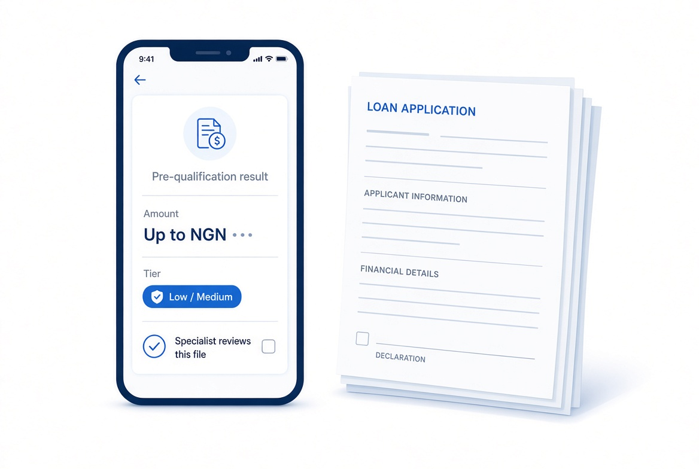
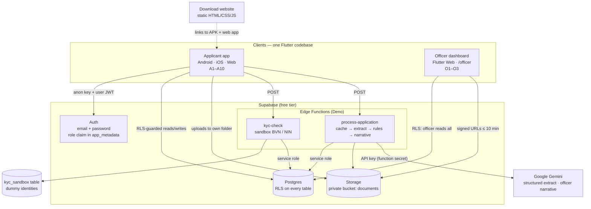
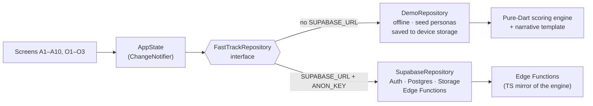
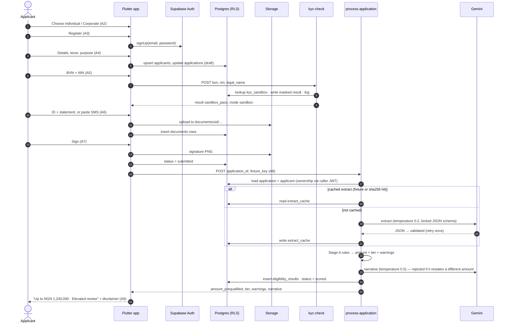
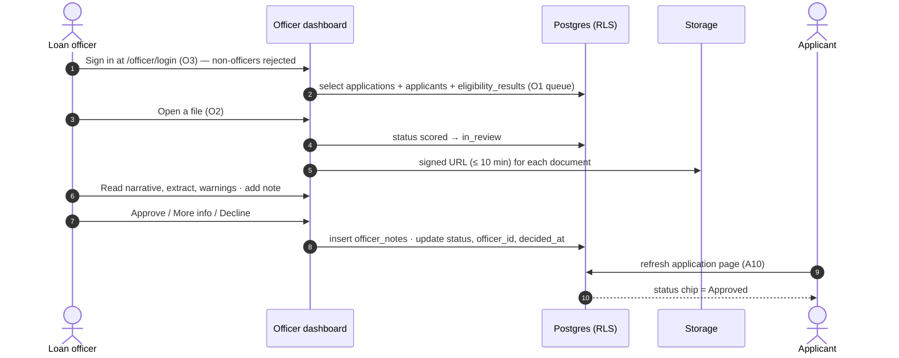
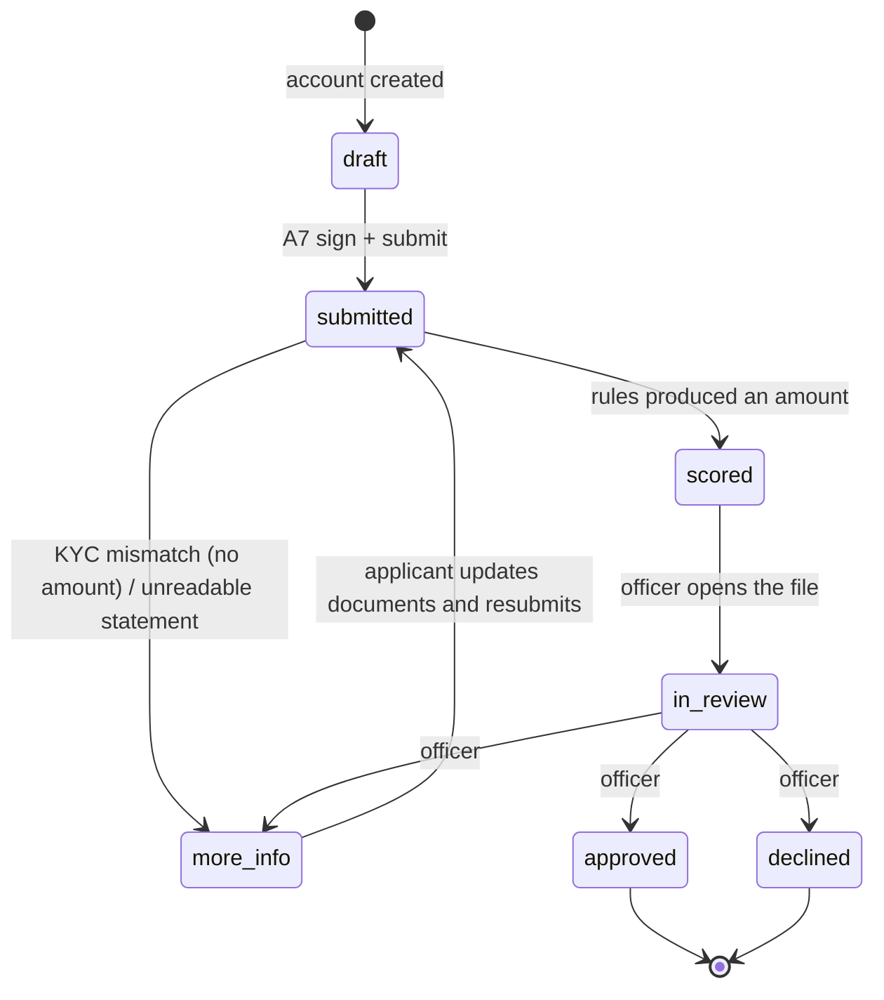
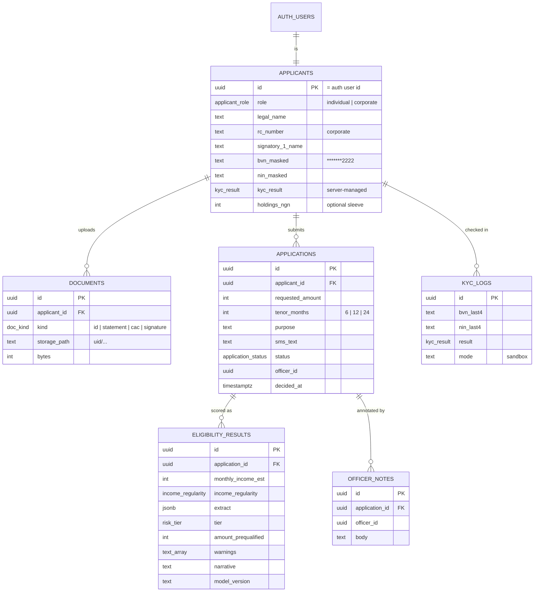

<p align="center">
  
</p>

<p align="center">
  <strong>Digital onboarding and instant loan pre-qualification for investment and lending desks.</strong><br>
  Onboarding + scored loan files. <em>Human still approves.</em>
</p>

<p align="center">
  <a href="https://github.com/adeyanjufuhad/FastTrack/actions/workflows/ci.yml"></a>
  <a href="https://github.com/adeyanjufuhad/FastTrack/releases/latest"></a>
  
  
  
</p>

> [!IMPORTANT]
> **Pilot / demo build.** Identity (BVN / NIN) checks run against a clearly labelled **sandbox**. Every result is a **pre-qualification, not an offer of credit**. The AI reads statements; **the firm's rules set the amount**; **a person makes the decision**. No real customer data belongs in this repository.

---

## Contents

1. [What FastTrack is](#1-what-fasttrack-is)
2. [The problem it solves](#2-the-problem-it-solves)
3. [What's in this repository](#3-whats-in-this-repository)
4. [System architecture](#4-system-architecture)
5. [How a file moves through the system](#5-how-a-file-moves-through-the-system)
6. [The Flutter app](#6-the-flutter-app)
7. [The backend (Supabase)](#7-the-backend-supabase)
8. [Document intelligence (Gemini)](#8-document-intelligence-gemini)
9. [The scoring engine](#9-the-scoring-engine)
10. [KYC sandbox](#10-kyc-sandbox)
11. [Data model](#11-data-model)
12. [Security and privacy](#12-security-and-privacy)
13. [Design system](#13-design-system)
14. [The download website](#14-the-download-website)
15. [Getting started](#15-getting-started)
16. [Testing and quality](#16-testing-and-quality)
17. [Deployment](#17-deployment)
18. [How it was built](#18-how-it-was-built)
19. [Project status, limits and roadmap](#19-project-status-limits-and-roadmap)
20. [Repository map](#20-repository-map)

---

## 1. What FastTrack is

FastTrack replaces the **PDF account form** and the **calculator-only loan page** that many boutique Nigerian investment and lending firms still use with a **five-minute digital flow**:

| Step | Client does | FastTrack does |
|---|---|---|
| 1 | Chooses **Individual** or **Corporate** | Switches to the right field set (personal details, or RC number + two signatories) |
| 2 | Enters **BVN and NIN** | Checks them against the sandbox identity register; keeps only the last four digits |
| 3 | Uploads a **government ID** and a **bank statement** — or pastes **bank-alert SMS** | Stores files privately; reads income, spend and existing repayments |
| 4 | **Signs on screen** | Applies the firm's lending rules → **pre-qualified amount + risk tier** + an officer narrative |
| 5 | Sees **"Up to NGN X"**, a plain-language tier and a reference | The same record lands in the **officer queue** as a scored file |
| 6 | Watches the status on their application page | An officer reads the file, adds notes, and **approves / asks for more info / declines** |

One Flutter codebase delivers the **applicant app** (Android, iOS, web) and the **officer dashboard** (web). A static **download website** introduces the product and links to the app.

<p align="center">
  
</p>

---

## 2. The problem it solves

| What the client sees today | What the firm pays for | What the officer inherits |
|---|---|---|
| A form or a PDF, then silence | Printing, scanning, emailing, re-keying | A raw attachment — no income extract, no tier |
| A calculator that outputs a monthly payment | Expectation without eligibility | A number the client believes that may not survive a real read |
| No status, no reference, no next step | Invisible drop-off in an inbox | No queue, no shared language between officers |

FastTrack is **the front door and the first read** — not a bank, not a credit bureau, not core banking. The buyer is the desk that still runs 2014 operations behind a 2026 website: boutique asset managers with a lending arm, mortgage and private-credit teams, cooperatives and staff-loan schemes.

---

## 3. What's in this repository

| Part | Path | Technology | Purpose |
|---|---|---|---|
| **App** | [`app/`](app/) | Flutter 3.44 · Dart 3.12 | Applicant flow A1–A10 and officer dashboard O1–O3; offline demo mode and Supabase mode |
| **Backend** | [`supabase/`](supabase/) | Postgres · Row Level Security · Storage · Deno Edge Functions | Data, access control, file vault, KYC sandbox, extract → score → narrative orchestrator |
| **Backend (Neon)** | [`neon/`](neon/) | Neon Postgres · Neon Auth · Object Storage · one Neon Function (Node 24) | The same backend on Neon: schema + seeds, and a single `fasttrack` HTTP API that enforces the access rules itself. The app does not call it yet — see [`neon/README.md`](neon/README.md) |
| **Website** | [`website/`](website/) | HTML · CSS · vanilla JS | Blue-and-white download / marketing site |
| **Product docs** | [`docs/`](docs/) | Markdown | PRD, screens, scoring rules, Gemini contracts, security, sprint plan, pitch run-sheet |
| **Fixtures** | [`fixtures/`](fixtures/) | Text · JSON | Seed personas, sample bank-alert SMS, locked expected scores |
| **Contracts** | [`api/openapi.yaml`](api/openapi.yaml), [`tickets/`](tickets/) | OpenAPI 3 · Markdown | Edge Function HTTP surface; FT-00 … FT-19 issue list |
| **CI** | [`.github/workflows/ci.yml`](.github/workflows/ci.yml) | GitHub Actions | Analyze + test the app; type-check + test the Edge Functions |

**By the numbers:** 41 Dart source files (~5,600 lines) · 13 screens · 58 Dart tests + 4 Deno tests · 2 Edge Functions · 8 Postgres tables · 3 seeded personas · 1 rules file.

---

## 4. System architecture

### 4.1 Big picture



**Three rules shape the whole design:**

1. **Amounts come from rules, never from the model.** Gemini extracts facts and writes prose; a deterministic rules engine sets the naira amount and the tier.
2. **Only the anon key ships in the app.** The service-role key and the Gemini key live exclusively in Edge Function secrets. Clients cannot write KYC results, scores or decisions.
3. **The pitch must never depend on the network.** An offline demo repository runs the whole product on-device with seeded, cached results.

### 4.2 Two runtime modes, one interface

The UI talks to a single `FastTrackRepository` interface. The implementation is chosen at start-up from build-time configuration:



| | **Offline demo mode** | **Supabase mode** |
|---|---|---|
| Enabled when | No `--dart-define` values | `SUPABASE_URL` + `SUPABASE_ANON_KEY` supplied |
| Auth | Local accounts, SHA-256 password hashes | Supabase Auth |
| Data | Device storage (browser `localStorage` on web) — survives refresh | Postgres with RLS |
| Files | Kept with the demo state (≤ 600 KB each) | Private Storage bucket |
| Statement reading | Seed fixture cache; conservative offline SMS parser for other text | Cache first, then Gemini (text or multimodal PDF / image) |
| Scoring | `app/lib/scoring/score_engine.dart` | `supabase/functions/_shared/score.ts` (tested for parity) |
| Best for | Pitches, rehearsals, no-network rooms | Pilots with real enquiries |

---

## 5. How a file moves through the system

### 5.1 Applicant journey (Supabase mode)



### 5.2 Officer decision



### 5.3 Application lifecycle



Applicants may only move a file between `draft`, `submitted` and back from `more_info`; every other transition is made by an Edge Function (service role) or an officer. This is enforced in Postgres, not just in the UI.

---

## 6. The Flutter app

### 6.1 Screen inventory — thirteen screens, nothing extra

| ID | Route | Screen | Key behaviour |
|---|---|---|---|
| A1 | `/` | Splash | Wordmark, one sentence, *Get started*; *Reset demo* in demo mode |
| A2 | `/role` | Role | Individual / Corporate, large tap targets |
| A3 | `/auth` | Register / sign in | Email + password, NDPR privacy note, "Officer? Use the web dashboard" |
| A4 | `/details` | Details — step 1 of 4 | Role-specific fields, tenor 6/12/24, draft save and restore |
| A5 | `/kyc` | Identity — step 2 of 4 | BVN + NIN, **amber sandbox chip**, result banner, sample identities |
| A6 | `/documents` | Documents — step 3 of 4 | ID (+ CAC for corporates), statement **or** SMS paste, 8 MB cap, thumbnails |
| A7 | `/sign` | Sign — step 4 of 4 | Signature canvas → PNG, legal name + timestamp, consent |
| A8 | `/processing` | Processing | Three honest steps; retry and "paste SMS instead" on failure |
| A9 | `/result` | Result | "Up to NGN X", tier in words, 4-line summary, reference `FT-XXXXXXXX`, **sandbox chip + disclaimer above the fold** |
| A10 | `/home` | My application | Status chip, amount, progress timeline, next action |
| O3 | `/officer/login` | Officer sign in | Rejects non-officer sessions |
| O1 | `/officer` | Queue | Stats, filter chips, search, table (wide) or cards (narrow) |
| O2 | `/officer/applications/:id` | File | Documents, extract, rules result, narrative, notes, decision buttons |

### 6.2 Code layout

```
app/lib/
├── main.dart                 # picks DemoRepository or SupabaseRepository; LIVE_KYC guard
├── app.dart                  # MaterialApp.router + go_router with role guards
├── config/env.dart           # --dart-define values (anon key only)
├── models/                   # enums mirror Postgres; Extract schema; records
├── scoring/                  # PURE DART — no Flutter, no network
│   ├── score_config.dart     #   every policy constant, in one place
│   ├── score_engine.dart     #   Stage A rules → amount, tier, warnings
│   └── narrative.dart        #   Stage B fallback + applicant summary
├── data/
│   ├── repository.dart       # the one interface the UI depends on
│   ├── demo_repository.dart  # offline backend, persistence, reset
│   ├── demo_store.dart       # device storage (localStorage / prefs) + in-memory for tests
│   ├── supabase_repository.dart
│   ├── fixtures.dart         # sandbox identities, sample SMS, cached extracts
│   └── local_extractor.dart  # conservative offline SMS reader (confidence 0.4)
├── state/                    # AppState (ChangeNotifier) + AppScope (InheritedNotifier)
├── theme/                    # blue & white tokens, fluid() sizing, ThemeData
├── widgets/                  # logo, chips, frame + ActionBar, signature pad, sample ID, reset
└── screens/applicant/ (A1–A10) · screens/officer/ (O1–O3)
```

### 6.3 Architecture decisions inside the app

| Concern | Choice | Why |
|---|---|---|
| State | One `AppState` `ChangeNotifier` exposed through an `InheritedNotifier` | Thirteen screens and one application per applicant don't need a state-management framework |
| Routing | `go_router` with a redirect guard | Officer routes require the officer role; wrong role bounces to A10; signed-out users go to A3 |
| Backend seam | `FastTrackRepository` interface | Offline demo and Supabase share every screen; tests use an in-memory store |
| Money | Integers (whole naira); displayed as `NGN 1,240,000` | No floating point in stored amounts; no naira glyph where fonts break |
| Fluid layout | `fluid(min, max)` interpolates sizes between 360 px and 1280 px viewports | Same idea as CSS `clamp()` on the website |
| Responsiveness | `ActionBar` stacks on phones, sits inline on wide screens; A9 and O2 go two-column ≥ 900 px | Primary CTAs are never cut off; the sandbox chip is visible without scrolling at 1366×768 |
| Signature | A small `CustomPainter` → PNG via `PictureRecorder` | No paid or heavy dependency; honest about not being a qualified e-signature |

### 6.4 Dependencies

`go_router` · `supabase_flutter` · `file_picker` · `google_fonts` · `url_launcher` · `shared_preferences` · `crypto` — all free, none require a billing account (a hard rule from the spec).

---

## 7. The backend (Supabase)

### 7.1 Migrations and seeds

| File | What it does |
|---|---|
| [`migrations/…01_schema.sql`](supabase/migrations/20260925000001_schema.sql) | Enums, 8 tables, indexes, `is_officer()` helper (reads `app_metadata.role`) |
| [`migrations/…02_rls.sql`](supabase/migrations/20260925000002_rls.sql) | RLS on every table, KYC-column guard trigger, private `documents` bucket (8 MB, JPEG/PNG/PDF) with per-user folder policies |
| [`seed.sql`](supabase/seed.sql) | Sandbox identities + cached extracts for the three personas |
| [`seed_personas.sql`](supabase/seed_personas.sql) | Persona users, applicants, scored applications and eligibility rows so the officer queue is populated; grants the demo officer its role |

### 7.2 Edge Functions

| Function | Contract | Notes |
|---|---|---|
| `kyc-check` | `POST {bvn?, nin?, legal_name}` → `{result, matched_name?, mode: "sandbox"}` | BVN **or** NIN hit passes; `00000000000` always fails; unknown → `mismatch`. Stores masked values, logs last four digits. Refuses to run if `LIVE_KYC=true` |
| `process-application` | `POST {application_id, fixture_key?}` → `{status, amount_prequalified, tier, warnings, narrative, applicant_summary}` | Errors: **401** no JWT · **403** not owner · **409** KYC mismatch (row written, no amount) · **422** unreadable · **503** Gemini down and no cache |

Shared code lives in [`functions/_shared/`](supabase/functions/_shared/): `http.ts` (CORS, user vs service-role clients, SHA-256, masking), `gemini.ts` (prompts, schema validation, narrative checks) and `score.ts` (the TypeScript mirror of the rules engine plus the narrative template).

---

## 8. Document intelligence (Gemini)

Gemini is used as **a structured extractor first and a writer second** — never as the decision-maker.

| Call | Temperature | Input | Output | Guardrails |
|---|---|---|---|---|
| **Extract** | 0.2 | SMS text, or the statement PDF / image (multimodal), plus role and tenor | Locked JSON schema (below) | JSON-only response; schema validation; one "Return JSON only." retry; failure → `more_info` |
| **Narrative** | 0.5 | Amount, tier, warnings, validated extract | 80–140 words for the officer, ending in one next action | Rejected if outside 60–170 words or if it mentions a figure of NGN 100,000 or more that isn't the computed amount or an extract fact → falls back to the deterministic template |

```json
{
  "monthly_income_est": 420000,
  "income_regularity": "stable | lumpy | seasonal | insufficient_history",
  "inflow_months_observed": 3,
  "top_spend_categories": [{ "category": "pos_retail", "monthly_avg": 85000, "share_of_outflow": 0.31 }],
  "existing_loan_debits": [{ "label": "Carbon", "monthly_avg": 15000 }],
  "overdraft_or_reversals": false,
  "average_balance_proxy": 190000,
  "confidence": 0.82,
  "warnings": []
}
```

**Caching.** Every extract is cached in `extract_cache` under `sha256(role + tenor + source + text)` (or a hash of the file bytes). Seeded walks pass a `fixture:*` key, so rehearsals and pitches never spend Gemini quota or depend on the network. The model version and raw output are stored with each result for debugging.

---

## 9. The scoring engine

Stage A is a **pure function**: the same extract always gives the same amount. All constants live in one file — [`score_config.dart`](app/lib/scoring/score_config.dart) (mirrored in [`score.ts`](supabase/functions/_shared/score.ts)) — so a credit committee can change the multiplier in a meeting.

```
usable   = monthly_income − 0.30 × (sum of detected lender repayments)
base     = usable × 3 × (tenor_months ÷ 12)
amount   = min(base, 6 × monthly_income)
amount  ×= 0.70  if income is lumpy or seasonal
amount  ×= 0.40  if history is insufficient
amount  ×= 0.75  if overdrafts / reversals
amount  ×= 0.80  if model confidence < 0.45
amount   = round down to the nearest NGN 10,000   (after snapping to whole naira)
```

| Rule | Effect on tier |
|---|---|
| Stable income, no flags | **Low** |
| Any lender detected, lumpy/seasonal, reversals, or low confidence | at least **Medium** |
| Insufficient history, ≥ 3 lenders (stacking), or ≥ 2 of {irregular, reversals, ≥ 2 lenders} | **High** |
| Amount below NGN 50,000 | **High** + manual-review warning |
| KYC mismatch or fail | **No amount**, status `more_info` |
| Holdings sleeve (off by default) | `+ min(30 % of holdings, base)` for existing portfolio clients |

**Locked test vectors** ([`fixtures/expected_scores.json`](fixtures/expected_scores.json)):

| Persona | Inputs | Working | Result |
|---|---|---|---|
| **Adaeze O.** (individual) | NGN 420,000 stable salary · Carbon NGN 15,000/mo · confidence 0.82 | (420,000 − 4,500) × 3 = 1,246,500 | **NGN 1,240,000 · Medium** |
| **Ibrahim M.** (individual) | NGN 280,000 lumpy · Palmpay 40,000 + unknown 25,000 · reversals | 260,500 × 3 × 0.70 × 0.75 = 410,287 | **NGN 410,000 · High** |
| **Northshore Trading** (corporate) | NGN 1,800,000 lumpy business inflows · no lenders | 5,400,000 × 0.70 = 3,780,000 | **NGN 3,780,000 · Medium** |

> The original handoff reference engine rounded raw floating-point values and produced NGN 3,770,000 for Northshore (5.4 m × 0.7 = 3,779,999.99…). Both engines now snap to whole naira before rounding down; a test locks the fix.

On screen, the applicant sees the tier in words — **Standard review / Elevated review / High review** — never a score. The officer sees the exact amount, tier, warning chips (external lender, stacking, irregular income, reversals, thin history, low confidence) and the narrative.

---

## 10. KYC sandbox

Live BVN / NIN verification in Nigeria is a paid, per-lookup service. v1 ships a **sandbox register** and says so on screen, verbatim:

> *Demo mode — sandbox verification. Production requires a licensed KYC provider.*

| BVN | NIN | Result |
|---|---|---|
| `22222222222` | `11111111111` | pass — Adaeze |
| `33333333333` | `11111111112` | pass — Ibrahim |
| `44444444444` | `11111111113` | pass — Chioma (optional existing client) |
| `55555555555` | `11111111114` | pass — Northshore signatory |
| `00000000000` | `00000000000` | always fails |
| anything else | anything else | mismatch → no amount |

A compile-time `LIVE_KYC` flag must stay `false`; the app refuses to start and the function refuses to run if it is set. Swapping in a real provider later is one function behind the same interface.

---

## 11. Data model



Two service-only tables complete the schema: `kyc_sandbox` (dummy identities) and `extract_cache` (hashed inputs → extract JSON). Every enum in Postgres is mirrored in [`app/lib/models/enums.dart`](app/lib/models/enums.dart) so the UI and the database can't drift.

---

## 12. Security and privacy

### 12.1 Who can do what (enforced by Row Level Security)

| Table | Applicant | Officer | Edge Functions (service role) |
|---|---|---|---|
| `applicants` | read / write own row — **except** KYC and holdings columns (trigger) | read all | write KYC result, masked IDs |
| `applications` | create own; edit only while `draft` / `submitted` / `more_info`, and only back to `draft` / `submitted` | read all; set status, `officer_id`, `decided_at` | set `scored` / `more_info` |
| `documents` + Storage | own rows and own `<uid>/` folder | read all (signed URLs ≤ 10 min) | read statements for extraction |
| `eligibility_results` | read own | read all | **only writer** |
| `officer_notes` | — | read / write (as themselves) | — |
| `kyc_logs` | read own | read all | **only writer** |
| `kyc_sandbox`, `extract_cache` | — | — | **only reader / writer** |

> The handoff pack's original RLS let applicants write their own KYC result, insert their own score and set their own application to "approved". The migration here closes all three; the header of [`…02_rls.sql`](supabase/migrations/20260925000002_rls.sql) documents the change.

### 12.2 Keys and secrets

- Flutter holds **only** the anon / publishable key (`--dart-define`). The service-role key and `GEMINI_API_KEY` exist **only** as Edge Function secrets.
- `.env` is gitignored; [`.env.example`](.env.example) shows the shape.
- The demo store keeps SHA-256 password hashes, never plain text.

### 12.3 PII posture (NDPR-aware)

- Minimum collection; a privacy note on A3; nothing is emailed.
- BVN / NIN stored as `*******1234`; logs keep the last four digits only.
- Gemini receives statement text or files plus role and tenor — never passwords or raw BVNs.
- Seed data only in pitches; wipe the demo project after public laptops.

---

## 13. Design system

**Blue and white, fintech — not a payday app.** Colours come straight from the FastTrack mark: the upper bar is blue, the lower bar and the wordmark are navy.

| Token | Hex | Use |
|---|---|---|
| `navy` | `#0A2463` | wordmark, headings, primary buttons |
| `navySoft` | `#14337F` | officer chrome, "Medium" tier |
| `blue` | `#2B76E5` | logo accent, links, focus, progress, "Low" tier |
| `blueDeep` | `#1D5BC6` | labels, text links |
| `sky` | `#EAF2FE` | tinted cards, icon wells |
| `mist` | `#F5F8FD` | page wash |
| `white` | `#FFFFFF` | surfaces |
| `amber` | `#B45309` on `#FEF3C7` | **sandbox chip only** |
| `ok` / `danger` | `#15803D` / `#B91C1C` | approve / decline |

- **Type:** Plus Jakarta Sans, 700–800 for headings with slight negative tracking.
- **Fluid sizing:** the app interpolates between 360 px and 1280 px viewports; the website uses `clamp()` for type, spacing and radii, and `auto-fit` grids.
- **Motion:** 200 ms; honest progress ticks on A8; reveal-on-scroll on the website, disabled by `prefers-reduced-motion`.
- **Logo:** redrawn as a crisp 64×64 vector (`website/assets/logo-mark.svg`, `LogoMark` in Flutter) and rendered to every web, Android and iOS icon size.

Full reference: [`docs/design/tokens.md`](docs/design/tokens.md).

---

## 14. The download website

A dependency-free static site in [`website/`](website/): hero with the brand illustration, "the PDF is the old door" before/after, four-step how-it-works, feature grid, an officer-queue preview (labelled demo data), an honest *is / is not* section, **Get FastTrack** download panel, FAQ and footer disclaimer.

| Button | Target |
|---|---|
| Android (APK) | `releases/latest/download/fasttrack.apk` — always the newest GitHub Release |
| Web app | `app/` — the Flutter web build hosted beside the site |
| iPhone | "Coming soon" (no store build in v1) |

Details and hosting notes: [`website/README.md`](website/README.md).

---

## 15. Getting started

### 15.1 Prerequisites

Flutter 3.44+ (Dart 3.12) · Chrome · for Android builds, the Android SDK · for the backend, a free Supabase project and a Google AI Studio key · optionally Deno 2 for function tests.

### 15.2 Offline demo — two minutes

```bash
cd app
flutter pub get
flutter run -d chrome
```

Walk **Adaeze**: *Get started* → *Individual* → register any email → details → tap the **Adaeze O.** sample identity → **Use sample ID** + her **sample alerts** → sign → **Up to NGN 1,240,000 · Elevated review**. Then open `/officer/login` as `officer@fasttrack.demo` / `FastTrack!demo1`, open the file (same amount), add a note and approve. The applicant's page shows **Approved**.

Demo state survives a page refresh; **Reset demo** restores the three seed personas. Presenting? Use the [pitch run-sheet](docs/PITCH-RUNSHEET.md).

### 15.3 Full stack — Supabase + Gemini

1. Create a Supabase project (any region, free tier).
2. In the SQL editor run, in order: `supabase/migrations/20260925000001_schema.sql` → `…02_rls.sql` → `supabase/seed.sql`.
3. **Auth → Users:** add `applicant@fasttrack.demo` and `officer@fasttrack.demo` (password `FastTrack!demo1`), then run `supabase/seed_personas.sql` (seeds the persona files and grants the officer role).
4. Deploy the functions and set the key **as a function secret only**:
   ```bash
   supabase functions deploy kyc-check
   supabase functions deploy process-application
   supabase secrets set GEMINI_API_KEY=your-key
   ```
5. Run the app against it:
   ```bash
   cd app
   flutter run -d chrome \
     --dart-define=SUPABASE_URL=https://YOUR_PROJECT.supabase.co \
     --dart-define=SUPABASE_ANON_KEY=your-anon-key
   ```

### 15.4 Configuration reference

| Name | Where | Purpose |
|---|---|---|
| `SUPABASE_URL`, `SUPABASE_ANON_KEY` | `--dart-define` (app) | Switch from offline demo to Supabase mode |
| `LIVE_KYC` | `--dart-define` (app), function env | Must stay `false` in v1 |
| `GEMINI_API_KEY` | Edge Function secret | Gemini extract + narrative |
| `GEMINI_MODEL` | Edge Function env (optional) | Defaults to `gemini-2.5-flash` |
| `SUPABASE_SERVICE_ROLE_KEY` | Provided to Edge Functions by Supabase | Never in the app |

---

## 16. Testing and quality

```bash
cd app && flutter analyze && flutter test        # 58 tests
deno test supabase/functions/_shared/            # 4 parity tests
```

| Suite | What it proves |
|---|---|
| `score_engine_test.dart` (16) | The three locked vectors, KYC blocking, caps, every haircut, stacking, thin history, manual-review floor, holdings sleeve, determinism, formatting, offline extractor, narrative |
| `demo_repository_test.dart` (5) | A live application, session, note and decision survive a reload; reset; passwords stored hashed; corrupt state recovers |
| `layout_test.dart` (37) | **Every screen at 360×740, 768×1024 and 1366×768** renders fully loaded with **no overflow** (cut-off content fails the test); A9 amount === O2 amount; the sandbox chip and disclaimer are **above the fold** at 1366×768 |
| `score_test.ts` (4) | The TypeScript engine matches the Dart engine on the same vectors |

**CI** ([`ci.yml`](.github/workflows/ci.yml)) runs on every push and pull request: `flutter analyze`, `flutter test`, `deno check` on both functions and the parity tests.

**Beyond automated tests:** the full applicant → officer → applicant loop was walked by hand in the browser, and the key screens were captured with headless Chrome at exactly 1366×768 (the conference-room HDMI size named in the definition of done).

---

## 17. Deployment

| Target | How |
|---|---|
| **Web app** | `flutter build web --release --base-href /app/` → copy `app/build/web` to `website/app/` |
| **Website + web app** | Deploy the `website/` folder to any static host (GitHub Pages, Vercel, Netlify, Firebase Hosting). Applicant flow at `/app/`, officer at `/app/#/officer/login` |
| **Android** | `flutter build apk --release` → attach as `fasttrack.apk` to a GitHub Release ([v0.1.0](https://github.com/adeyanjufuhad/FastTrack/releases/tag/v0.1.0) is live). Currently debug-signed: fine for sideloading onto demo phones, not for the Play Store |
| **Backend** | Supabase migrations + `supabase functions deploy` (see §15.3) |
| **Backend (Neon)** | `npm run migrate` + `neon functions deploy fasttrack --src functions/fasttrack/index.ts`, from `neon/` (see [`neon/README.md`](neon/README.md)) |

---

## 18. How it was built

### 18.1 Inputs

- **Developer handoff pack:** PRD, screen inventory, user stories FT-01…FT-19, scoring rules, Gemini contracts, KYC sandbox, security notes, schema / RLS / seed SQL, fixtures and a sprint plan.
- **Project specification (PDF):** the product shape, the zero-cost stack, the demo script and the "where cost re-enters" boundary.
- **CEO brief (PDF):** the business case — kept out of this public repository because it is marked confidential.
- **Brand pictures:** the FastTrack logo, the phone-vs-paper illustration and the campaign lines *"Built for investment and lending desks"*, *"The PDF is the old door. A five-minute file is next."*, *"Coming soon."*

### 18.2 Build sequence

```mermaid
flowchart LR
    P0["0 · Setup<br/>repo, Flutter project,<br/>packages, icons"] --> P1["1 · Core logic<br/>pure-Dart rules engine<br/>+ locked test vectors"]
    P1 --> P2["2 · Data layer<br/>repository interface,<br/>offline demo, Supabase"]
    P2 --> P3["3 · Screens<br/>A1–A10, O1–O3,<br/>blue & white theme"]
    P3 --> P4["4 · Backend<br/>schema, hardened RLS,<br/>Edge Functions, seeds"]
    P4 --> P5["5 · Website<br/>static, fluid,<br/>brand imagery"]
    P5 --> P6["6 · Verify<br/>browser walk-through,<br/>fixes, CI"]
    P6 --> P7["7 · Pitch-ready<br/>persistence, reset,<br/>1366×768 pass, APK"]
```



1. **Rules first.** The scoring engine was written as a pure function and tested against the spec's worked examples before any UI existed — the rest of the system is built around that number.
2. **One seam.** A repository interface let the whole product run offline for demos while the Supabase implementation was built against the same contract.
3. **Screens from the inventory.** Exactly the thirteen screens in `docs/screens.md`, with the locked disclaimer and sandbox copy.
4. **Backend hardened, not copied.** The handoff schema was kept verbatim; the RLS was tightened; the Edge Functions implement the documented HTTP contract, with a TypeScript mirror of the engine tested for parity.
5. **Verified in a real browser.** Walking the flow end to end surfaced layout issues on narrow screens (overlapping app-bar actions, wrapping toggles, squashed bottom bars), which led to the shared `ActionBar` and compact variants.
6. **Pitch-readiness pass.** Demo state now survives a refresh; a reset control restores the seed data; a layout test matrix covers every screen at three sizes; headless 1366×768 captures caught the sandbox chip sitting below the fold on A9 (fixed and locked by a test); the Android APK was published as a release.

### 18.3 Decisions that differ from the handoff pack

| Topic | Handoff pack | This build | Why |
|---|---|---|---|
| Palette | Navy / ivory / gold | **Blue and white** from the logo | Product direction; functional colours unchanged |
| RLS | Applicants could write KYC result, score, approval | Server-only writes; guarded transitions | Integrity of the decision |
| Rounding | Floors raw doubles (NGN 3,770,000 for Northshore) | Snap to naira, then floor (NGN 3,780,000) | Floating-point bug |
| SMS minimum | "≥ 20 lines" | ≥ 10 lines | The seed fixtures carry ten alerts |
| Demo aids | — | Sample identities, sample alerts, "Use sample ID" (demo mode only) | A pitch laptop shouldn't need real documents |
| Northshore SMS | Not provided | Added `fixtures/sample_sms_northshore.txt` | Needed for the corporate walk |

---

## 19. Project status, limits and roadmap

### Status

| Area | State |
|---|---|
| Applicant flow, officer dashboard, offline demo | ✅ Built, tested, walked end to end |
| Layout at phone / tablet / 1366×768 | ✅ Automated matrix + headless captures |
| Android APK | ✅ [Released](https://github.com/adeyanjufuhad/FastTrack/releases/latest) (debug-signed; not yet tried on a physical device) |
| Supabase schema, RLS, Edge Functions | 🟡 Implemented and type-checked; **not yet run against a live project** |
| Hosted website + web app | ⏳ Ready to deploy; host not chosen yet |
| 90-second backup recording | ⏳ To record on the pitch laptop |
| iOS store build | ⏳ Not in v1 |

### Deliberately out of scope for v1

Live NIBSS / KYC providers · credit-bureau pulls (CRC / FirstCentral) · disbursement, collections and payment gateways · notifications and chat · qualified e-signature / stamp duty · a product catalogue · anything that claims to be an offer of credit.

### Natural next steps — only when a firm asks

Loan against portfolio as a first-class product · bureau pull behind the same interface as the KYC sandbox · officer SLA timer and "older than 48 hours" filter · Pidgin / English toggle on the applicant summary · a licensed KYC provider for a live pilot.

---

## 20. Repository map

```
FastTrack/
├── README.md                  ← you are here
├── .env.example               # shape of local config (never commit .env)
├── .github/workflows/ci.yml   # analyze + test app, check + test Edge and Neon functions
├── api/openapi.yaml           # Edge Function HTTP contract
├── app/                       # Flutter app (applicant + officer)
│   ├── lib/                   #   see §6.2
│   ├── test/                  #   score engine, demo persistence, layout matrix
│   ├── web/ android/ ios/     #   platform shells, branded icons
│   └── README.md
├── supabase/
│   ├── migrations/            # schema + hardened RLS + storage bucket
│   ├── functions/             # kyc-check, process-application, _shared/
│   ├── seed.sql               # sandbox identities + cached extracts
│   └── seed_personas.sql      # persona files for the officer queue
├── neon/                      # the same backend on Neon (see neon/README.md)
│   ├── migrations/ seeds/     #   schema, sandbox identities, personas, demo officer
│   ├── functions/fasttrack/   #   the one Neon Function: auth, API, storage
│   └── functions/_shared/     #   rules engine + Gemini (ported from supabase/)
├── website/                   # static download site (+ app/ when deployed)
├── docs/                      # PRD, screens, scoring, Gemini, security, run-sheet, design tokens
├── fixtures/                  # personas, sample SMS, expected scores
└── tickets/github-issues.md   # FT-00 … FT-19
```

---

<p align="center">
  <br>
  <sub><strong>FastTrack</strong> — the missing five minutes between "Open an account" and a file an officer can sign.<br>
  Pre-qualification results are not offers of credit. Identity checks in the pilot build use sandbox data. A specialist reviews every file.</sub>
</p>
